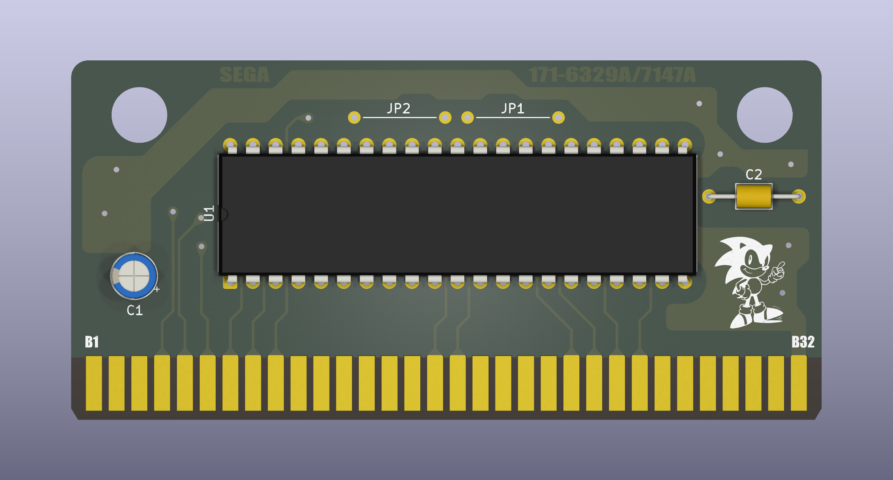
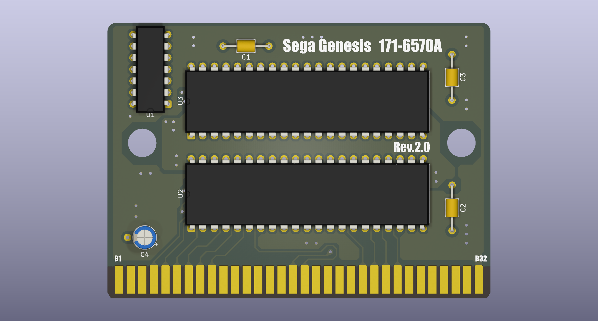
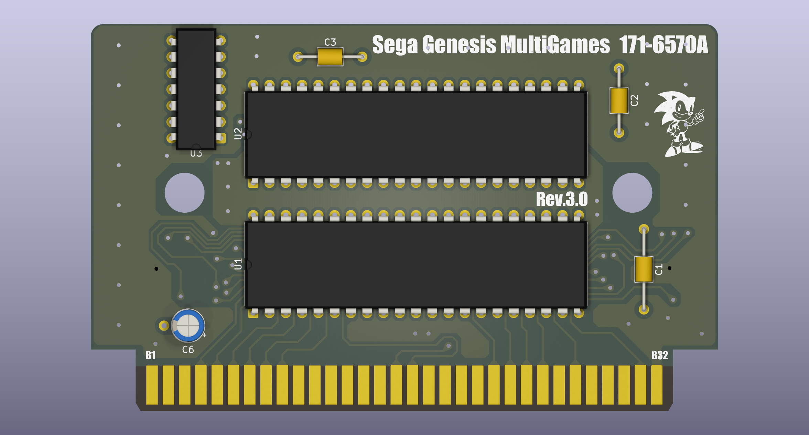
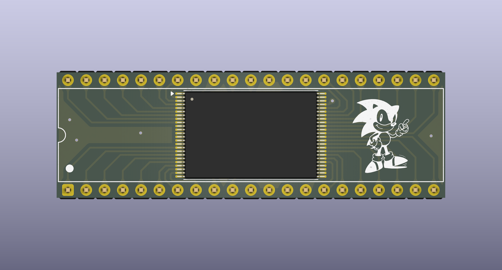

# 🎮 Cartridge-SEGA: Sega Genesis Cartridge PCBs 🕹️

[](https://github.com/viuhimciuc/Cartridge-SEGA/stargazers)
[](https://github.com/viuhimciuc/Cartridge-SEGA/network/members)
[](https://github.com/viuhimciuc/Cartridge-SEGA/issues)
[](LICENSE)

An open-source collection of hardware design files for **Sega Genesis / Mega Drive** cartridge PCBs (Printed Circuit Boards). Designed from scratch or reverse-engineered using **KiCad**, this repository provides schemas and layouts for creating custom cartridges, multi-game boards, and memory adapters.

---

## 📂 Repository Structure

The project is organized into several key hardware modules:

*   **`GEN-CART-171-6329A-7147A`** — Replica or custom variant of standard Sega Genesis cartridge PCBs.
*   **`GEN-CART-171-6570A`** — Re-engineered files based on the classic 171-6570A board layout.
*   **`GEN-CART-171-6570A_MultiGames`** — Modded version supporting multiple games on a single cartridge via bank switching or custom routing.
*   **`TSOP_Adapter_M29FxxxF`** — A specialized adapter board converting TSOP flash memory chips (like the M29F series) to DIP/SOP layouts suitable for retro console cartridges.

---

## 🛠️ Built With

*   [KiCad EDA](https://www.kicad.org/) — A Cross-Platform and Open Source Electronics Design Automation Suite.

---

## 📸 Gallery & Visuals

### 🔧 Component Placement / PCB Layout Preview

<p align="center">
  
  
  
  
</p>

---

## 🚀 Getting Started

### 📋 Prerequisites
To open, edit, or export production files (Gerbers) from this project, you need:
*   **KiCad 7.0 or newer** (Recommended)

### 📥 Cloning the Repository
```bash
git clone https://github.com/viuhimciuc/Cartridge-SEGA.git
```

### ⚙️ How to Generate Gerber Files for Manufacturing
1. Open the `.kicad_pro` project file from any folder in KiCad.
2. Open the **PCB Editor** (`.kicad_pcb`).
3. Go to **File** -> **Fabrication Outputs** -> **Gerbers (.gbr)**.
4. Set your output directory and click **Plot**.
5. Click **Generate Drill Files** to export standard NC drill configurations.
6. Zip all generated files and send them to your preferred PCB manufacturer (e.g., JLCPCB, PCBWay).

---

## 🤝 Contributing

Contributions, bug reports, and hardware improvements are highly welcome! 
1. **Fork** the Project.
2. Create your **Feature Branch** (`git checkout -b feature/AmazingFeature`).
3. **Commit** your Changes (`git commit -m 'Add some AmazingFeature'`).
4. **Push** to the Branch (`git push origin feature/AmazingFeature`).
5. Open a **Pull Request**.

---

## 📄 License

This project is licensed under the MIT License - see the [LICENSE](LICENSE) file for details.

---

<p align="center"> Developed with ❤️ for the Retro Gaming Community </p>
